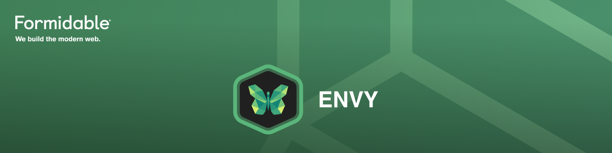
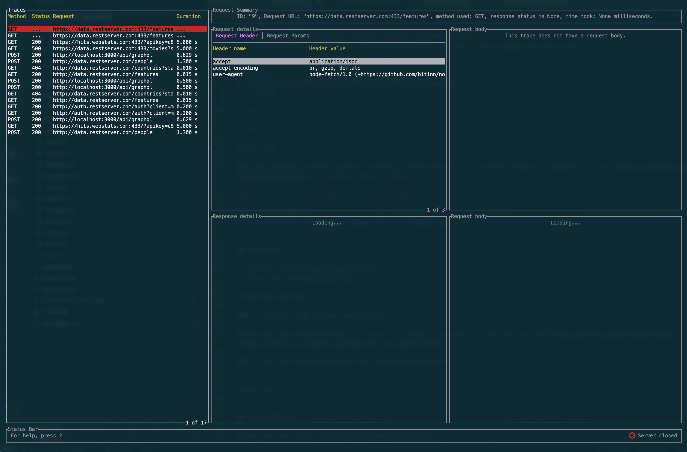

<div align="center">
  <a href="https://formidable.com/open-source/" target="_blank">
    
  </a>

  <strong>
   Terminal-based Node.js Telemetry &amp; Network Inspector
  </strong>

  <br />
  <br />
</div>

# Envy TUI

Envy TUI displays network traffic for Node.js applications in a terminal window. It depends on [Envy](https://github.com/FormidableLabs/envy) to receive network traces.

_Note: Envy TUI is intended for local development_

<div align="center">
  
</div>

## Contents

- [Getting Started](#getting-started)
- [Contributing](#contributing)

## Getting Started

### 1. Install Envy in your application

Follow the Envy documentation to [install a telemetry package for your application](https://github.com/FormidableLabs/envy#2-install-a-telemetry-package-for-your-application)

### 2. Run the application and start collecting telemetry

```
cargo run
```

## Contributing

Please see the [Contributing guide](CONTRIBUTING.md).

## Maintenance Status

**Active:** Formidable is actively working on this project, and we expect to continue for work for the foreseeable future. Bug reports, feature requests and pull requests are welcome.